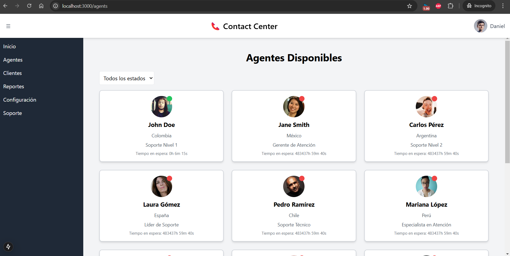
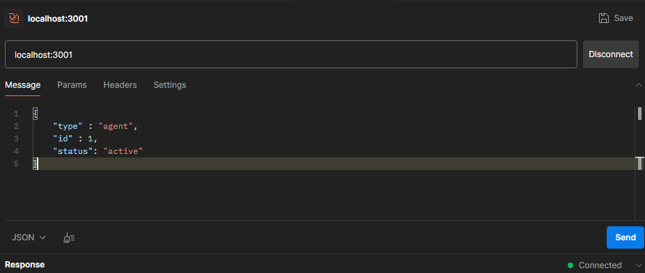
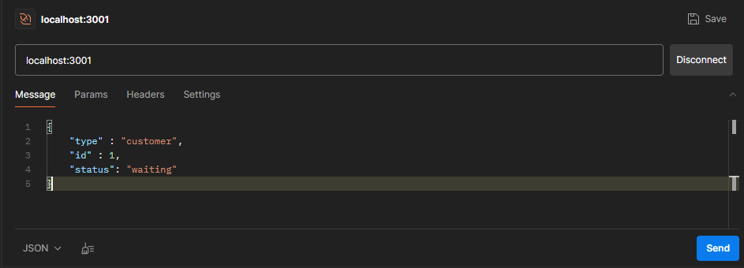

# 📞 Contact Center - Web App

## 📌 Descripción
**Contact Center** es una aplicación desarrollada en **Next.js** que permite la gestión en tiempo real de agentes y clientes dentro de un centro de atención. La aplicación utiliza **WebSockets** para actualizar la información en vivo y cuenta con filtros dinámicos para mejorar la experiencia de usuario.



---

## 🚀 Tecnologías utilizadas
- **Next.js** (App Router, TypeScript, ESLint, Tailwind CSS, Turbopack)
- **React** (con componentes reutilizables y estado optimizado)
- **WebSockets** (para actualizaciones en tiempo real)
- **Jest & React Testing Library** (para pruebas de los componentes)
- **Preline UI + Tailwind CSS** (para una interfaz moderna y adaptable)

---

## 🔧 Instalación y ejecución

### 1️⃣ **Clonar el repositorio**
```sh
  git clone https://github.com/tu-usuario/contact-center.git
  cd contact-center
```

### 2️⃣ **Instalar dependencias**
```sh
npm install
```

### 3️⃣ **Configurar variables de entorno**
Crea un archivo `.env.local` en la raíz del proyecto con los siguientes valores:
```ini
NEXT_PUBLIC_API_BASE_URL=http://localhost:3001
NEXT_PUBLIC_WS_URL=http://localhost:3001
```
Si el servidor de WebSockets está en otro puerto o dominio, cámbialo en esta variable.

### 4️⃣ **Ejecutar la aplicación**
```sh
npm run dev
```
La aplicación estará disponible en `http://localhost:3000`.

---

## 🔥 Funcionalidades principales
✅ **Listado de clientes y agentes en tiempo real**

✅ **Actualización automática mediante WebSockets**

✅ **Filtros dinámicos para buscar agentes y clientes**

✅ **Diseño moderno con Tailwind CSS**

✅ **Pruebas automatizadas con Jest y React Testing Library**

---

## 🌐 Vistas de la aplicación

### 🏠 **Landing Page**
📍 Presentación del proyecto y del desarrollador.

### 👥 **Gestión de Clientes**
📍 Listado de clientes en espera con detalles y filtros.

### 🏢 **Gestión de Agentes**
📍 Listado de agentes disponibles con estado en vivo.

---

## 🛠️ Cómo probar WebSockets en la aplicación
Para probar el sistema de WebSockets y ver actualizaciones en tiempo real:

1️⃣ **Inicia el servidor WebSocket** (si está en local, usa `http://localhost:3001`).

2️⃣ **Abre la aplicación en dos pestañas diferentes** en `http://localhost:3000/agents` o `http://localhost:3000/customers`.

3️⃣ **Envía un mensaje WebSocket manualmente**:
Puedes usar una herramienta como Postman usando la petición que se observa en la parte inferior para actualizar la información.

Petición para Agentes


Petición para Clientes


Esto actualizará la información en todas las pestañas abiertas.

---

## 🧪 Ejecución de pruebas
Para correr las pruebas de los componentes:
```sh
npm test
```
Esto ejecutará los test con **Jest y React Testing Library**.

---

## 👨‍💻 Desarrollador
**Daniel Pérez**  
📍 Estudiante de Ingeniería de Sistemas en la Universidad Nacional de Colombia.  
💡 Apasionado por las competencias de programación y el uso de la tecnología para resolver problemas.

---

## 🎯 Mejoras futuras
- ✅ Integración con una API de autenticación.
- ✅ Implementación de métricas en tiempo real.
- ✅ Optimización de rendimiento con carga diferida y caching.

🚀 ¡Gracias por revisar este proyecto!
